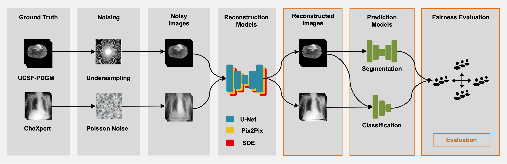
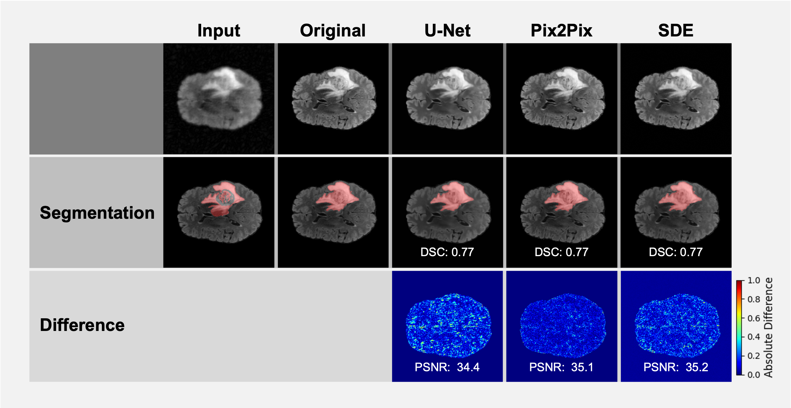
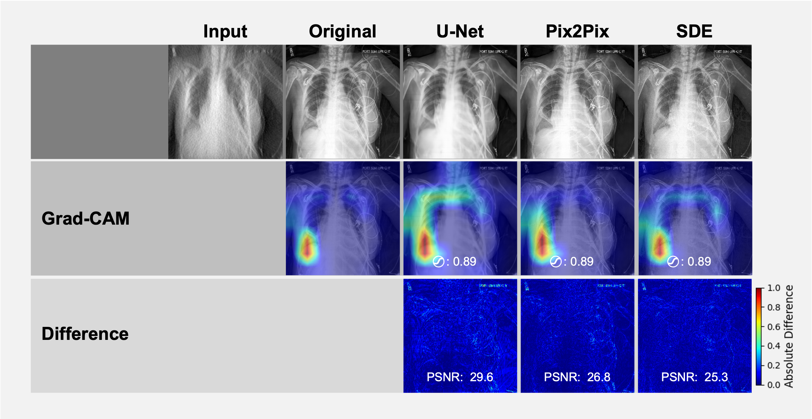
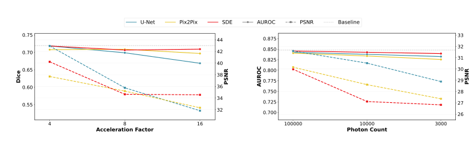
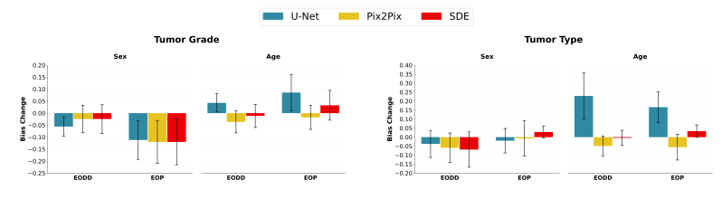
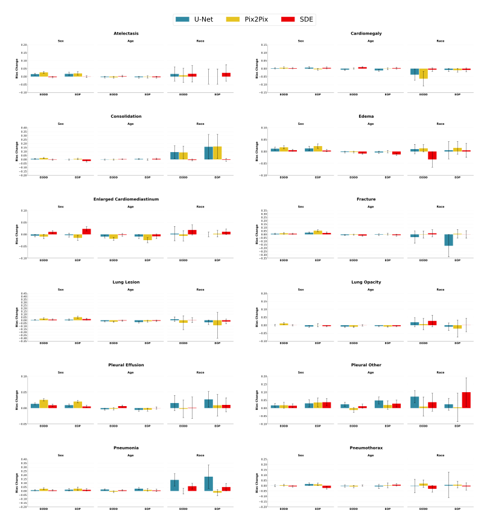
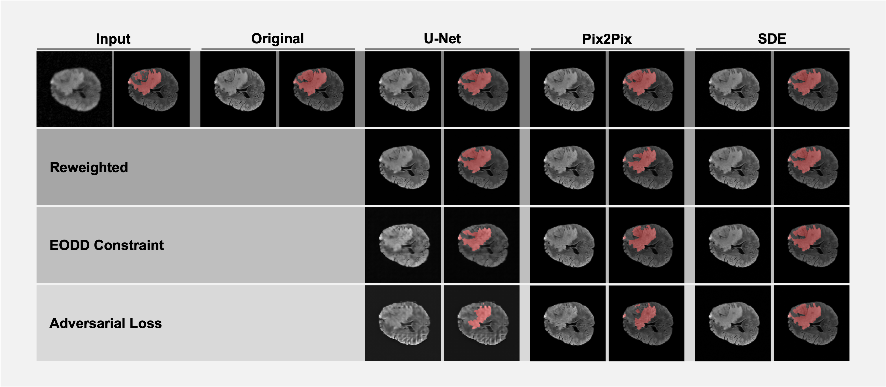
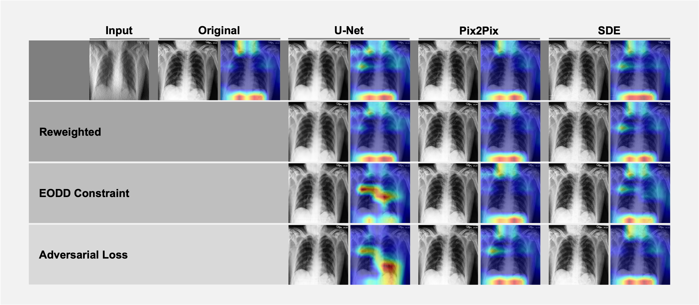
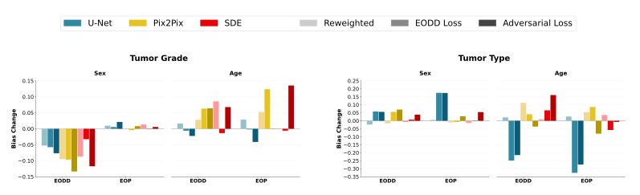
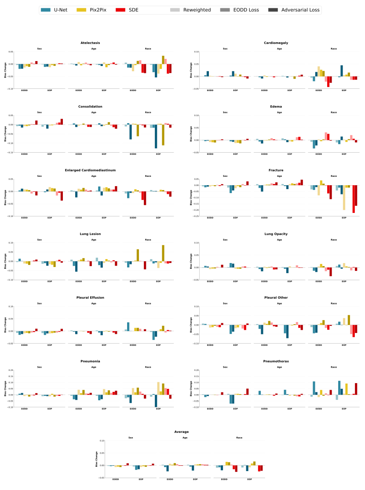

# Fair Medical Image Reconstruction and Evaluation

This repository provides an overview and integration of multiple projects focused on **bias evaluation and mitigation in medical image reconstruction**, specifically applied to the **UCSF-PDGM MRI** and **CheXpert chest X-ray** datasets. It includes reconstruction methods (U-Net, GAN, SDE), mitigation strategies (reweighting, adversarial training, Equalized Odds), and a comprehensive evaluation pipeline.

## Introduction

The growing adoption of artificial intelligence in medical imaging has underscored the importance of fairness, ensuring that applied deep learning models do not introduce new or aggravate existing biases. Our research contributes to this space with two core contributions:

1. **Bias Evaluation**: We introduce a framework to assess how reconstruction models affect fairness in downstream tasks. By varying noise levels and applying different reconstruction techniques, we reveal conditions where disparities arise across sensitive attributes such as sex and age.

2. **Bias Mitigation**: We investigate three fairness interventions—sample reweighting, Equalized Odds (EODD), and adversarial training—applied to U-Net, Pix2Pix, and SDE models. Our experiments quantify trade-offs in reconstruction quality and downstream fairness, emphasizing that reconstruction has limited elasticity to significantly reduce bias.

---

## Repositories Overview

This meta-repo connects and documents the following projects:

### 1. [recon_bias](https://github.com/lotterlab/recon_bias.git)

> **Reconstruction & Classification for UCSF and CheXpert**

Contains U-Net-based reconstruction models and classifiers. Includes multiple branches for different datasets and mitigation strategies.

- **Branches**:
  - `ucsf`: UCSF-PDGM reconstruction, classification, segmentation
  - `chexpert`: CheXpert reconstruction and classification
  - `reweighting`, `eodd`, `adversarial`: Bias mitigation strategies

---

### 2. [pix2pix](https://github.com/MatteoWohlrapp/pix2pix.git)
Based on Isola, P., Zhu, J.Y., Zhou, T., Efros, A.A.: Image-to-image translation with conditional adversarial networks. CVPR (2017)

> **Forked GAN Architecture for CheXpert & UCSF**

Pix2Pix GAN modified to support UCSF-PDGM and CheXpert datasets. Includes fairness interventions.

- **Branches**:
  - `master`: Standard reconstruction
  - `reweighting`, `eodd`, `adversarial`: Bias mitigation techniques

---

### 3. [image-restoration-sde](https://github.com/MatteoWohlrapp/image-restoration-sde.git)
Based on Luo, Z., Gustafsson, F.K., Zhao, Z., Sjölund, J., Schön, T.B.: Image restoration with mean-reverting stochastic differential equations. In: Krause, A., Brunskill, E., Cho, K., Engelhardt, B., Sabato, S. Scarlett, J. (eds.) Proceedings of the 40th International Conference on Machine Learning. Proceedings of Machine Learning Research, vol. 202, pp. 23045–23066. PMLR (23–29 Jul 2023), https://proceedings.mlr.press/v202/luo23b.html

> **Diffusion-Based Image Restoration**

Stochastic Differential Equation (SDE) model adapted for medical image reconstruction and fairness experiments.

- **Branches**:
  - `main`: Base version
  - `reweighting`, `eodd`, `adversarial`: Mitigation strategies

---

### 4. [recon_bias_evaluation](https://github.com/MatteoWohlrapp/recon_bias_evaluation.git)

> **Evaluation & Visualization Framework**

Evaluation tools for reconstruction quality, downstream classification/segmentation, and fairness metrics across demographic groups. Also includes visualization and reporting utilities.

- **Modules**:
  - `processing/`: Batch processing of datasets through models
  - `prediction/`: Task-specific inference modules
  - `evaluation/`: Fairness analysis, AUROC/PSNR reporting
  - `visualization/`: Heatmaps, Grad-CAM, segmentation overlays

---

### 5. [torchxrayvision (fork)](https://github.com/mlmed/torchxrayvision)
Based on Cohen, J., Viviano, J.D., Bertin, P., Morrison, P., Torabian, P., Guarrera, M., Lungren, M.P., Chaudhari, A., Brooks, R., Hashir, M., & Bertrand, H. (2021). TorchXRayVision: A library of chest X-ray datasets and models. International Conference on Medical Imaging with Deep Learning. 

> **X-Ray Classification Backbone (adapted for CheXpert)**

Used as a downstream model for evaluating reconstruction-induced bias. Our fork includes minor dataset integration adjustments.

---

## How to Use This Project

### 1. Clone Submodules (if using this as a meta-repo)
```bash
git clone --recurse-submodules https://github.com/your-user/meta-repo.git
```
Or clone manually each sub-repository if preferred.

### 2. Explore Individual Repositories

Each repository contains its own instructions and configuration. See the individual README.md files in each repo for branch-specific code usage, dataset preparation, model training, evaluation and visualization pipelines.


## Results
Detailed reports for evaluation and mitigation can be found in the root of this repository, along with a presentation of the results.

### Bias Evaluation

We present a comprehensive evaluation of fairness in medical image reconstruction, demonstrating that reconstruction models—though often overlooked—can introduce subtle but impactful biases into downstream classification and segmentation tasks. Our results show that fairness disparities are most consistently observed across sex and age, with race showing high variability. 




Qualitative reconstruction results and derived segmentation masks for UCSF-PDGM (acceleration factor 8) show high visual similarity across reconstructions with no differences in segmentation performance and slight PSNR difference. For CheXpert, (photon count 10,000). Pix2Pix and SDE produce perceptually realistic images but introduce artifacts or hallucinated structures, while U-Net yields smoother results with fewer anomalies. Grad-CAM maps show largely consistent activation patterns across models.


Segmentation performance and image quality after reconstruction for UCSF-PDGM across noise levels (left). Dice metrics show high stability across models and noise conditions, while PSNR drops with increasing noise, indicating the robustness of downstream tasks to image degradation. Averaged classification performance and image quality after reconstruction on CheXpert across noise levels (right). U-Net maintains stronger image metrics than Pix2Pix and SDE, particularly at higher noise. However, all models preserve general AUROC performance across the noise spectrum, while PSNR drops with increasing noise.



Bias change in tumor type and tumor grade classification on UCSF-PDGM due to reconstruction. Overall slightly reduced bias for sex with increases for age. Across models and attributes high standard error.


Classification bias changes after reconstruction on CheXpert, broken
down by pathology. Certain pathologies (e.g., Consolidation, Pleural Other, Pneumonia) show large subgroup disparities post-reconstruction. These shifts do not consistently align with baseline performance or fairness.

### Bias Mitigation
Extending this analysis, we adapt and apply three mitigation strategies—sample reweighting, Equalized Odds constraints, and adversarial loss—to U-Net, Pix2Pix, and SDE models. While these interventions yield modest fairness improvements, particularly for sex and age, their effectiveness is limited, and their application can degrade performance on certain datasets. These findings underscore the limited elasticity of reconstruction models in correcting bias and highlight the need to address fairness more holistically across the medical imaging pipeline.



Reconstructed images and segmentation mask visualizations of models trained on the UCSF-PDGM dataset pre- and post-mitigation have visually minimal changes; U-Net shows slightly larger deviations from original masks, but no clinically meaningful features are introduced. Reconstructed images and GradCAM visualizations of models trained on the CheXpert dataset pre- and post-mitigation also show minimal overall visual differences. However, there are subtle enhancement of support devices by SDE, and minor intensity shifts by GAN.



Bootstrapped bias differences pre- and post-mitigation on the UCSF-PDGM dataset. Lower bars indicate improved fairness. Large variability was observed, with no clear trend associated with specific models, attributes, or mitigation techniques.


Bootstrapped bias differences pre- and post-mitigation on the CheXpert dataset. Lower bars indicate improved fairness. Overall, slight bias improvements exist for U-Net and SDE; Pix2Pix worsens bias for specific pathologies.

## Ownership
This project was created by Matteo Wohlrapp and supervised by Niklas Bubeck at TUM, and Bill Lotter at Harvard Medical School and Dana-Farber Cancer Institute.